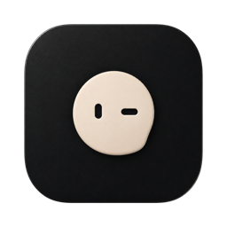

<p align="center">
  
</p>

<h1 align="center">Toby</h1>
<p align="center">A little more room for your mind.</p>
<p align="center">
  <a href="https://www.thetoby.app">Website</a> ·
  <a href="https://github.com/rohanphw/toby/releases">Releases</a> ·
  <a href="https://www.thetoby.app/privacy">Privacy</a> ·
  <a href="CONTRIBUTING.md">Contributing</a>
</p>

Your voice, notes, and meetings. An open-source second brain for your Mac.

Toby gives the things you think about a place to go. Talk through an idea, write a note, or capture a meeting. Come back later, find the useful parts, and ask your chosen AI provider to help with the follow-through.

Built in Swift and SwiftUI, with local storage and no third-party Swift dependencies.

## What Toby does

- **Think out loud.** Start a conversation from the app, menu bar, or Control–Option–Space. Speech is transcribed on your Mac. Replies appear as text.
- **Keep notes and context.** Write notes, attach files, pin useful items, and explicitly mark things to Remember for future conversations.
- **Capture meetings.** Record microphone and Mac audio, keep the transcript, and generate editable meeting notes through your selected provider.
- **See your schedule.** Connect multiple Google accounts, choose calendars, view event details, and open meeting links. Mac calendars are optional.
- **Use selected Drive files.** Attach files through Google's picker or save a note or meeting transcript as a new Google Doc.
- **Choose your provider.** Use your installed Codex or Grok CLI, with its existing login and available models.
- **Organize your library.** Search with Command–K, archive conversations, or permanently delete their local records and workspace files.

## Availability

**[Download Toby v0.10.1 for Apple Silicon](https://github.com/rohanphw/toby/releases/download/v0.10.1/Toby-0.10.1-arm64.dmg)** · [Release notes and checksum](https://github.com/rohanphw/toby/releases/tag/v0.10.1)

Requires **an Apple Silicon Mac running macOS 14 or later**. Open the DMG, drag Toby to Applications, then open Toby from Applications. The app is Developer ID signed and notarized by Apple. Intel builds are not included.

This is an early release. **Google OAuth verification is still pending**: connecting Google may show an unverified-app warning or be restricted by Google or your organization. Local notes and provider-backed AI features do not require a Google connection. On-device speech recognition depends on language and system support.

## Build from source

You need a Mac with macOS 14 or later and an Xcode toolchain supporting Swift 5.10 or later. AI features also need an installed, authenticated [Codex CLI](https://developers.openai.com/codex/cli) or [Grok CLI](https://docs.x.ai/build/overview). Provider access and usage limits belong to your provider account.

```sh
git clone https://github.com/rohanphw/toby.git
cd toby
swift build -c release
```

This compiles the source without Google credentials or a signing certificate. To produce a runnable app bundle with macOS permission descriptions and a stable signature:

1. Create an **Apple Development** certificate through Xcode → Settings → Accounts → Manage Certificates.
2. Configure your own Google **Desktop app** OAuth client using [Google setup](docs/google-calendar.md). Keep its JSON outside Git.
3. Quit the copy of Toby you are rebuilding, then run:

```sh
GOOGLE_OAUTH_CLIENT_FILE="/absolute/path/to/desktop-client.json" \
  scripts/build-app.sh
```

The script creates `dist/Toby.app` without launching it. Open that bundle to try the app; use the bundle rather than `swift run` for permission-sensitive features. Move it to Applications before enabling launch at login.

The script selects and locally pins an Apple Development certificate. Set `CODE_SIGN_IDENTITY` to choose one explicitly. `APP_BUNDLE_PATH` can build into a separate staging location. Ad-hoc signing is intentionally rejected because changing signing identity can invalidate macOS permission grants. Developer ID signing and notarization are separate release steps.

Source builds need their own Google client configuration. The maintainer's OAuth JSON, user tokens, signing keys, and notarization credentials are not included in this repository. Forks should use their own Google project and branding.

## First use

Open Toby and follow its resumable setup flow. Connect a provider, select a model, and grant microphone or speech permissions when you want to use voice. Setup can be skipped for local notes.

Google accounts connect through the browser from setup or Settings. Calendar access is read-only. Drive actions use only selected or app-created files. Meeting capture and automatic scheduled recording are separate, explicit choices.

| Shortcut | Action |
| --- | --- |
| Control–Option–Space | Start talking |
| Command–K | Search |
| Command–Return | Send a typed follow-up |
| Command–Comma | Open settings |

## Data and privacy

Toby stores its library and workspace files in `~/Library/Application Support/TobyNext/`. Google account tokens are stored in macOS Keychain. Voice-mode audio is not saved; meeting recordings are saved locally.

AI features send prompts, relevant conversation text, remembered content, and files read by the selected CLI to that provider. Meeting summaries send transcript text, not the raw recording. These features are not fully offline. The CLI's own configuration and the provider's policies also apply.

Remember is explicit. Archiving excludes an item from future app-supplied context and memory. Deleting removes the local item and its workspace; it does not erase provider history, backups, exported files, or documents already saved to Google Drive.

Read the [privacy policy](https://www.thetoby.app/privacy) and [architecture notes](docs/architecture.md) for details.

## Current limits

- Automatic meeting recording follows calendar timing and supported meeting links. It does not establish whether you actually joined, wake a sleeping Mac, or join a call for you. Toby must be running.
- Meeting audio can include other audio playing on your Mac. Transcript channels identify microphone versus system audio, not individual speakers.
- There is one active AI task at a time. Long transcripts and supplied context have size limits, documented in the architecture notes.
- CLI behavior depends on the installed version. Compilation does not establish runtime compatibility; release testing is tracked in the [QA handoff](docs/QA-HANDOFF.md).
- There is no cross-device sync or Gmail integration.

## Contributing and support

Bug reports and focused contributions are welcome. Read [CONTRIBUTING.md](CONTRIBUTING.md) for setup and validation expectations. Use [GitHub Issues](https://github.com/rohanphw/toby/issues) for bugs and feature requests. For account-specific help, email [rohanphww@gmail.com](mailto:rohanphww@gmail.com).

Please report security concerns privately using [SECURITY.md](SECURITY.md).

## License

Toby's source code is available under the [MIT License](LICENSE). Bundled provider marks retain their [third-party license and attribution](Sources/Toby/Resources/ProviderMarks/NOTICE.md); their inclusion does not imply endorsement.

[Changelog](CHANGELOG.md) · [Architecture](docs/architecture.md) · [Google integration](docs/google-calendar.md)
